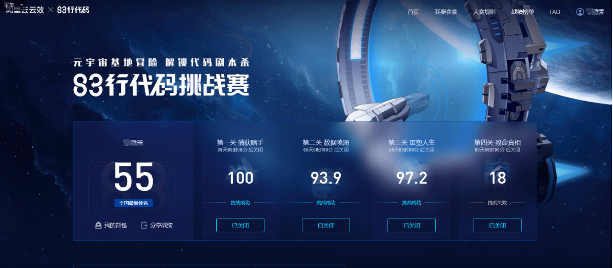

# 2021年81行代码挑战赛

#### 介绍
2021年阿里的81行代码挑战赛

第一关：考察全面素质能力，包含java基础、代码规范、linux以及安全相关。

第二关：考察阿里云API的使用以及数据结构和算法，核心是后头。考察了前缀树知识点，若是要分更高需要有进阶解法。

第三关：考察设计模式应用，让代码耦合度降低。(三个点：面向对象、代码复杂度以及代码规范)

第四关：考察框架应用层面，找bug并修正，共有10个bug，springsecurity+springwebflux(websocket)。

最终成绩55名

  

